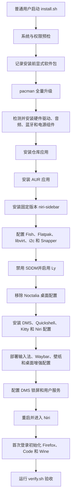

# CachyOS + Niri + DMS 安装流程与美化、应用清单

> 文档对应当前项目中的 `install.sh`、`packages.sh`、`assets/` 和 `bin/`。
> 目标桌面为：**CachyOS + 官方 Niri + DankMaterialShell（DMS）+ Quickshell + Kitty**。

## 1. 安装目标

安装器用于已经完成 CachyOS 基础安装的 `x86_64` 设备。安装完成后提供：

- 官方 Niri Wayland 合成器；
- DMS 面板、启动器、通知中心、控制中心、锁屏和动态主题；
- Quickshell，作为 DMS 的界面运行基础；
- Kitty，作为默认终端；
- Fcitx5 + RIME + 雾凇拼音中文输入；
- 双 Waybar、壁纸、暗色模糊 Overview、截图、录屏和长截图；
- Fish + Starship + eza + zoxide 命令行环境；
- 日常、办公、开发、影音、虚拟化和游戏应用；
- Btrfs/Snapper 快照、系统更新、清理、回滚和配置迁移工具。

安装器采用**完整安装模式**，不使用功能拆分开关。除硬件包、系统升级和终端选择外，应用与桌面增强默认全部安装。

## 2. 硬件适配与桌面迁移

安装器会从 `/proc/cpuinfo` 和 `/sys/class/drm` 自动识别 CPU、GPU 及当前绑定的内核驱动，支持：

- Intel 或 AMD CPU 微码；
- Intel Mesa/Vulkan 和媒体驱动；
- AMD Mesa/RADV 和媒体驱动；
- NVIDIA 专有驱动或 Nouveau/NVK；
- Intel + NVIDIA、AMD + NVIDIA 等混合显卡组合。

无法读取 DRM sysfs 时会回退到 PCI 设备信息。无法识别的硬件只安装通用组件并给出警告，不会套用其他厂商驱动。

桌面环境按全量覆盖方式迁移为：

```text
官方 Niri + DMS + Quickshell + Kitty + Ly
```

执行时会：

- 删除 CachyOS Noctalia 桌面配置包、Noctalia Shell 和 Noctalia Quickshell 包；
- 保留已经安装的官方 Niri，DMS 安装器会补齐或更新需要的组件；
- 替换受管理的 Niri 和 Kitty 配置；
- 删除 `~/.config/noctalia`；
- 禁用 SDDM，并启用 `ly@tty2.service`；
- 不修改 Windows 分区、Secure Boot、网络连接或引导器安装方式。

执行前应自行备份需要保留的 Noctalia、Alacritty、Kitty 和 Niri 配置。

## 3. 安装流程总览



## 4. 分阶段安装说明

### 4.1 启动前预检

`install.sh` 首先检查：

- 必须使用普通用户运行，不能直接使用 root；
- 系统 ID 必须是 `cachyos`；
- CPU 架构必须是 `x86_64`；
- `sudo`、`pacman`、`curl`、`systemctl`、`sha256sum` 等命令必须存在；
- Pacman 数据库不能处于锁定状态；
- DMS 版本号格式和终端参数必须有效。

默认终端为 Kitty。当前脚本仍接受 `kitty`、`ghostty` 或 `alacritty` 参数，但本项目实际约定使用 Kitty。

### 4.2 保存安装前状态

安装器把安装前的显式软件包列表保存到：

```text
~/.local/state/cachyos-niri-dms/packages-before-日期时间.txt
```

这用于之后比较新增软件，但不是完整系统镜像。

### 4.3 系统升级

默认执行：

```bash
sudo pacman -Syu --noconfirm
```

如果基础系统刚刚更新过，可以使用：

```bash
./install.sh --skip-update
```

不建议长期跳过滚动发行版的完整升级。

### 4.4 硬件和系统基础组件

默认检测并安装当前设备所需组件：

- `linux-firmware`，以及 `intel-ucode` 或 `amd-ucode`；
- Intel：Mesa、`vulkan-intel`、32 位 Vulkan 和 `intel-media-driver`；
- AMD：Mesa、RADV Vulkan 和 32 位 Vulkan；
- NVIDIA：根据当前绑定的 `nvidia` 或 `nouveau` 驱动选择用户态组件；未绑定驱动时回退到 `nvidia-open-dkms`；
- PipeWire、PipeWire ALSA/PulseAudio、WirePlumber；
- BlueZ 和蓝牙工具；
- `sof-firmware` 音频固件；
- `fwupd`、`bolt`、`v4l-utils`、`vulkan-tools`；
- `power-profiles-daemon`，或保留 CachyOS 已有的 `tuned-ppd`。

`./install.sh --dry-run` 会在执行计划中显示检测结果；`--skip-hardware` 可完全跳过硬件包和相关系统服务设置。

### 4.5 安装仓库应用

安装器按分类调用 `pacman -S --needed`。必需软件包只要有一个在仓库中不存在，该分类就会停止并报告具体包名。

当前 `packages.sh` 声明了 **103 个仓库软件包**，其中包含 Codex CLI 和 Claude Code。

### 4.6 安装 AUR 应用

使用 Paru 一次性安装全部 AUR 软件：

```bash
paru -S --needed --noconfirm -- 软件包列表
```

当前声明了 **14 个 AUR 软件包**。其中 Upscaler、CC Switch 和 `codex-desktop-git` 已放到 AUR 清单，避免把它们误当成官方仓库包。

### 4.7 安装 niri-sidebar

`niri-sidebar` 当前不依赖 AUR 包名，脚本直接下载固定版本：

```text
niri-sidebar v0.4.0
```

安装前核对固定 SHA-256，之后写入：

```text
/usr/local/bin/niri-sidebar
```

### 4.8 配置系统服务

安装器执行以下设置：

- 启用蓝牙；
- 启用 `libvirtd.service`；
- 将当前用户加入 `libvirt` 组；
- 添加用户级 Flathub；
- 把当前用户的登录 Shell 改为 Fish；
- 创建并配置 `i2c` 组，为 `ddcutil` 提供权限；
- 加载 `i2c-dev`；
- 在 Btrfs 根文件系统上创建 Snapper `root` 配置；
- 根据现有电源管理服务决定是否启用 `power-profiles-daemon`；
- 启用固件更新定时器（如果系统提供该服务）。

### 4.9 登录管理器切换

安装器会禁用已启用的 SDDM、GDM、LightDM、LXDM 或 greetd，然后启用：

```text
ly@tty2.service
```

安装期间不会立即重启。当前图形会话可能继续运行，但应在安装完成后重启。

### 4.10 Noctalia 迁移

目标机目前安装的是 CachyOS Noctalia 桌面预设。脚本在安装 DMS 前移除：

```text
cachyos-niri-noctalia
noctalia-shell
noctalia-qs
```

这里使用仅删除指定包的方式，避免递归删除已经存在的 Niri、Portal 和桌面基础依赖。

### 4.11 安装 DMS 桌面

安装器下载并校验官方 DMS 安装器：

```text
DankMaterialShell v1.5.3
```

执行等价于：

```bash
dankinstall \
  --compositor niri \
  --term kitty \
  --yes \
  --exclude-deps dms-greeter \
  --danksearch \
  --dankcalendar \
  --replace-configs "niri,kitty"
```

这一阶段安装或配置：

- 官方 Niri；
- DMS Shell 和 `dms` 命令；
- Quickshell；
- Kitty；
- Xwayland Satellite；
- DankSearch；
- DankCalendar；
- DMS 官方 Niri 和 Kitty 配置。

不安装 DMS Greeter，因为登录管理器由 Ly 负责。

### 4.12 部署桌面配置和辅助命令

项目中的 `bin/` 被安装到：

```text
/usr/local/bin/
```

项目中的桌面资源被同步到用户配置目录，并备份一份受管理的模板到：

```text
/usr/local/share/cachyos-desktop/
```

Niri 主配置会加入：

```kdl
include "cachyos-extras.kdl"
```

### 4.13 配置 DMS 锁屏

安装器：

- 安装 DMS 专用 PAM 配置；
- 合并 `assets/dms/lock-settings.json`；
- 执行 `dms auth resolve-lock --quiet`；
- 默认保持指纹和安全密钥解锁关闭；
- 只有注册成功后才启用对应解锁方式。

### 4.14 用户服务绑定

安装完成后执行：

```bash
systemctl --user add-wants niri.service dms.service
```

DMS 因此随 Niri 用户会话启动，而不会无条件在其他桌面环境中启动。

## 5. 桌面美化组件

| 组件 | 作用 | 安装后的定位 |
|---|---|---|
| Niri | 滚动平铺 Wayland 合成器 | 官方版本，不安装第三方修改版 |
| DMS | 面板、启动器、通知、控制中心、锁屏、主题 | 主桌面 Shell |
| Quickshell | QML/Qt Shell 运行框架 | DMS 的运行依赖，不是额外桌面面板 |
| Kitty | GPU 加速终端 | 默认终端，替换 Alacritty |
| Matugen | 根据壁纸生成 Material You 配色 | 为 DMS、Code 等生成动态颜色 |
| Waypaper | 图形化壁纸选择器 | 管理壁纸选择和恢复 |
| awww | Wayland 动态壁纸守护进程 | 提供壁纸切换动画 |
| Waybar | 可选顶栏和底栏 | 提供录屏、更新、护眼和 DDC 模块 |
| Fuzzel | 轻量 Wayland 启动器 | 辅助启动和脚本菜单 |
| Satty | 截图标注工具 | 截图后的编辑、标记和保存 |
| Waycorner | Wayland 热角 | 用独立工具实现热角动作 |
| Woomer | Wayland 放大镜 | 用快捷键启动屏幕放大 |
| niri-sidebar | Niri 窗口侧边栏 | 收纳、显示、翻转侧边栏窗口 |
| nirius | Niri 窗口效率工具 | 窗口跟随、快速聚焦或启动应用 |
| Fish | 交互式 Shell | 替换用户默认 Shell |
| Starship | Shell 提示符 | 提供统一美化提示符 |
| eza | `ls` 替代工具 | 彩色文件列表和图标显示 |
| zoxide | 智能目录跳转 | 根据使用频率快速跳目录 |
| Fastfetch | 系统信息展示 | 终端欢迎信息 |
| Noto 字体 | 拉丁、中文和 Emoji 字体 | 保证中文和图标显示完整 |

## 6. 美化与交互功能

### 6.1 暗色模糊 Overview

Niri 额外配置包含：

- 深色 Overview backdrop；
- DMS Overview 壁纸模糊，常驻模糊壁纸层关闭；
- DMS Overview 运行时默认使用 2 行 × 5 列。

这是官方 Niri + DMS 的组合实现，不依赖修改版 Niri。

### 6.2 壁纸与动态配色

流程为：

```text
Waypaper 选择壁纸
  → awww 执行切换动画
  → DMS/Matugen 提取颜色
  → 面板、终端和 Code 模板更新配色
```

### 6.3 双 Waybar

提供三条控制命令：

```text
cachyos-waybar-top
cachyos-waybar-bottom
cachyos-waybar-toggle
```

Waybar 不默认与 DMS 面板一起启动，避免重复面板。需要时通过快捷键启用。

Waybar 模块包括：

- 普通录屏和 GIF 录屏菜单；
- 当前录屏状态；
- Pacman/AUR 更新数量；
- `wlsunset` 护眼模式；
- `ddcutil` 外接显示器亮度；
- 常用系统状态与工作区信息。

### 6.4 截图和录屏

- `grim`：抓取 Wayland 屏幕图像；
- `slurp`：选择截图或录屏区域；
- `satty`：标注截图；
- `wf-recorder`：Wayland 录屏；
- FFmpeg：GIF 转换、视频处理；
- 智能长截图脚本：模拟翻页、检测重复帧并按重叠区域拼接。

### 6.5 当前系统快捷键迁移

安装器先让 DMS 生成标准 Niri 配置，然后执行以下覆盖：

```text
assets/niri/binds.kdl
  -> ~/.config/niri/dms/binds.kdl
```

这会把当前开发机的整套窗口、工作区、截图、DMS、媒体和应用快捷键复制到目标机。
配置已完成中性化处理，原有私有命令已替换为本项目提供的命令：

```text
快捷键教程       cachyos-keybind-help
录屏菜单         cachyos-record-menu
快速快照         cachyos-snapshot（无 TTY 时自动打开 Kitty）
快速回滚         cachyos-quick-rollback
窗口信息提取     cachyos-niri-pick
强制结束窗口     cachyos-niri-force-kill-window
截图编辑         cachyos-screenshot-edit
在此打开终端     terminal-here
企业微信阴影处理 wxwork-shadow-hider.py
```

关键入口：

```text
Super+Shift+/        搜索全部快捷键
Super+F1/F2/F3       输入法、DMS 设置、录屏菜单
Super+F5/F8          快速快照、快速回滚
Super+/ / T / Enter  Kitty 临时、共享和独立终端
Super+B / E / Z      Firefox、文件管理器、应用启动器
Super+Alt+O/C/B      OpenCode、Claude Code、Obsidian
Super+O / G          Niri Overview
Alt+4                强制结束点选窗口
Alt+Shift+F4         强制结束点选窗口及进程树
Super+方向键/HJKL    切换窗口和列
Super+1...9          切换数字工作区
Super+Ctrl+1...9     移动当前列到数字工作区
Print 系列           区域、窗口和显示器截图
Super+Alt+L/P        锁屏、锁屏并休眠
Ctrl+Alt+Delete      DMS 任务管理器
```

`assets/niri/cachyos-extras.kdl` 继续提供 Waybar、长截图、nirius、Woomer 和快速聚焦等项目增强快捷键，同时禁止 Niri 接管电源键，并启动企业微信阴影窗口处理。完整逐键清单见 `README.md` 的“默认快捷键”章节，也可以在安装后按 `Super+Shift+/` 搜索。

### 6.6 窗口效率

侧边栏和补充快捷键：

```text
Super+Alt+S / Super+M  将当前窗口加入或移出侧边栏
Super+Alt+Z            显示或隐藏侧边栏
Super+Alt+X            翻转侧边栏方向
Super+Alt+R            重新排列侧边栏窗口
Super+Alt+F6           切换 nirius 窗口跟随模式
Super+Alt+F7           启动 Woomer 放大镜
Super+Alt+1            快速聚焦或启动 Firefox
Super+Alt+2            快速聚焦或启动 Kitty
```

### 6.7 Firefox、Code 和 Wine 初始化

首次进入 Niri 后，`cachyos-post-login-setup` 会初始化：

- Firefox 企业策略、主题和基础布局；
- 浏览器去广告扩展策略；
- VS Code Matugen 配色模板；
- Wine 前缀、常用字体和中文字体修复。

初始化日志位于：

```text
~/.local/state/cachyos-desktop/post-login.log
```

## 7. 默认安装的用户应用

### 7.1 日常和网络应用

| 应用 | 作用 |
|---|---|
| Firefox | 默认网页浏览器 |
| Thunar | 轻量文件管理器，带归档、缩略图和自定义右键操作 |
| Nautilus | GNOME 文件管理器，作为独立备用文件管理器 |
| File Roller | 压缩包图形管理 |
| Transmission GTK | BitTorrent 下载客户端 |
| LocalSend | 局域网设备间传输文件 |
| QQ | Linux QQ 客户端 |
| 微信 | AppImage 版微信客户端 |
| Clash Verge Rev | 代理客户端和规则管理 |
| Obsidian | Markdown 笔记和知识库 |
| GNOME Calendar | 日历应用 |
| GNOME Clocks | 时钟、闹钟和计时器 |

### 7.2 系统管理应用

| 应用 | 作用 |
|---|---|
| Flatseal | 图形化管理 Flatpak 权限 |
| Mission Center | 图形化查看 CPU、内存、GPU、磁盘和网络状态 |
| GParted | 创建、调整和检查磁盘分区；需要谨慎使用 |
| LACT | AMD GPU 状态、功耗、频率和风扇管理 |
| EasyEffects | PipeWire 音频均衡器、降噪、压缩器和效果链 |
| Pavucontrol | PipeWire/PulseAudio 图形音量控制 |
| NetworkManager Editor | 图形化编辑网络连接 |
| Btrfs Assistant | 图形化管理 Btrfs 和 Snapper |
| Flatpak | 沙箱应用运行和安装平台 |
| Reflector | Arch 镜像源测速和更新工具 |
| Downgrade | 软件包降级工具 |

### 7.3 图片、音频和视频

| 应用 | 作用 |
|---|---|
| MPV | 轻量视频播放器 |
| imv | Wayland 图片查看器 |
| GIMP | 位图编辑 |
| Inkscape | SVG 矢量图编辑 |
| Audacity | 音频录制和编辑 |
| Kdenlive | 非线性视频剪辑 |
| OBS Studio | 直播、录屏和场景合成 |
| Upscaler | 使用超分辨率模型放大图片 |
| MediaInfo | 查看媒体编码和容器信息 |

### 7.4 办公和密码管理

| 应用 | 作用 |
|---|---|
| LibreOffice Fresh | 文档、表格和演示文稿 |
| KeePassXC | 本地密码数据库和自动填充 |

### 7.5 开发工具

| 应用 | 作用 |
|---|---|
| Git | 版本控制 |
| Neovim | 终端文本编辑器 |
| Visual Studio Code | 图形化代码编辑器 |
| OpenCode | AI 编程终端客户端 |
| Codex CLI | OpenAI 编程终端客户端 |
| Claude Code | Anthropic 编程终端客户端 |
| CC Switch | 管理多个 AI 编程工具的账号和配置 |
| Codex Desktop | 通过 `codex-desktop-git` 安装的桌面客户端 |
| ShellCheck | Shell 脚本静态检查 |
| base-devel | AUR 构建所需编译工具组 |

### 7.6 游戏和 Windows 兼容

| 应用 | 作用 |
|---|---|
| Steam | 游戏平台和 Proton 运行环境 |
| Lutris | 游戏与 Wine 前缀统一管理 |
| Wine | 运行 Windows 应用 |
| Winetricks | 安装 Wine 运行库、字体和组件 |
| ProtonPlus | 下载和管理 Proton-GE、Wine-GE 等兼容层 |
| Gamescope | 游戏微型合成器、缩放和帧率控制 |
| MangoHud | Vulkan/OpenGL 性能监控叠加层 |
| Gearlever | 安装、更新和管理 AppImage 应用 |

### 7.7 虚拟化

| 应用 | 作用 |
|---|---|
| virt-manager | libvirt/KVM 图形管理器 |
| QEMU Full | 完整虚拟机和硬件模拟组件 |
| swtpm | 为虚拟机提供软件 TPM |
| virt-viewer | 查看 SPICE/VNC 虚拟机画面 |

## 8. 中文输入方案

安装的软件包：

```text
fcitx5
fcitx5-gtk
fcitx5-qt
fcitx5-configtool
fcitx5-rime
rime-ice-git
noto-fonts
noto-fonts-cjk
noto-fonts-emoji
```

安装器部署：

- Fcitx5 环境变量；
- Fcitx5 Profile；
- RIME 默认自定义配置；
- 雾凇拼音输入方案；
- GTK、Qt 和 Electron/Wayland 应用输入支持。

安装后必须退出并重新登录一次，使环境变量完整生效。

## 9. 系统维护命令

安装后提供：

```text
cachyos-system-update           更新 Pacman、AUR 和 Flatpak
cachyos-system-clean            清理孤立包、缓存和旧日志
cachyos-update-status           显示仓库和 AUR 更新数量
cachyos-mirror-update           更新镜像列表
cachyos-snapshot [说明]         创建 Snapper 快照
cachyos-rollback 快照编号       准备 Snapper 回滚
cachyos-quick-rollback          在 Kitty 中选择并确认 Snapper 回滚
cachyos-niri-pick              提取窗口信息或屏幕颜色并复制
cachyos-niri-force-kill-window 强制结束点选窗口，可用 -f 结束进程树
cachyos-config                  配置更新、保护和迁移
cachyos-pkg-install             TUI 安装软件包
cachyos-pkg-remove              TUI 卸载软件包
cachyos-pkg-remove-tracked      卸载前后跟踪 HOME 残留文件
cachyos-flatpak-install         TUI 安装 Flatpak
cachyos-flatpak-remove          TUI 卸载 Flatpak
cachyos-grub-theme              切换已经安装的 GRUB 主题
cachyos-lock-doctor             检查 DMS 锁屏、PAM、指纹和安全密钥
cachyos-wine-setup              初始化 Wine 和字体
cachyos-firefox-setup           初始化 Firefox
cachyos-code-theme              生成 Code Matugen 主题
```

## 10. 远程执行方式

### 10.1 上传项目

在当前开发机执行：

```bash
scp -r /home/skynit/WorkSpace/cachyOS/cachyos-niri-dms \
  skynit@192.168.6.214:~/
```

不要把密码写入文档或脚本。

### 10.2 网络通道

目标机访问 GitHub 和 AUR 可能不稳定。可以从开发机建立反向 SOCKS 通道：

```bash
ssh -fN -R 127.0.0.1:18080 skynit@192.168.6.214
```

然后在目标机安装终端中设置：

```bash
export ALL_PROXY=socks5h://127.0.0.1:18080
export all_proxy="$ALL_PROXY"
export GIT_CONFIG_COUNT=1
export GIT_CONFIG_KEY_0=http.version
export GIT_CONFIG_VALUE_0=HTTP/1.1
```

这使 DMS、GitHub Release 和 AUR 下载通过开发机网络转发。

### 10.3 预览安装计划

```bash
cd ~/cachyos-niri-dms
./install.sh --dry-run --terminal kitty
```

### 10.4 正式安装

```bash
cd ~/cachyos-niri-dms
./install.sh --yes --terminal kitty
```

如果刚完成 `pacman -Syu`，可以使用：

```bash
./install.sh --yes --terminal kitty --skip-update
```

安装期间不要关闭 SSH、网络或开发机上的反向代理进程。

## 11. 安装后操作

安装器不会自动重启。安装完成后执行：

```bash
sudo reboot
```

重启后：

1. 在 Ly 中选择 Niri 会话；
2. 登录后等待首次初始化结束；
3. 检查 DMS 面板、通知、启动器和锁屏；
4. 检查 Kitty、Fcitx5、Waypaper、音频和蓝牙；
5. 再退出并登录一次，使 Fish、`libvirt` 和 `i2c` 用户组生效。

## 12. 验收命令

进入远程项目目录执行：

```bash
./verify.sh
dms doctor
cachyos-lock-doctor
niri validate
```

进一步检查：

```bash
systemctl --user status niri.service dms.service
systemctl status ly@tty2.service bluetooth.service libvirtd.service
vulkaninfo --summary
wpctl status
powerprofilesctl
ddcutil detect
fcitx5-diagnose
```

## 13. 预期结果

安装和重启后，预期系统为：

```text
CachyOS
├── Ly 登录管理器
└── Niri Wayland 会话
    ├── DMS
    │   ├── 面板与启动器
    │   ├── 通知与控制中心
    │   ├── 动态 Material 配色
    │   └── DMS 锁屏
    ├── Quickshell
    ├── Kitty
    ├── Fcitx5 + RIME + 雾凇拼音
    ├── Waypaper + awww + Matugen
    ├── 可选双 Waybar
    ├── Satty + wf-recorder + 智能长截图
    ├── niri-sidebar + nirius + Waycorner + Woomer
    └── 日常、开发、影音、虚拟化和游戏应用
```
